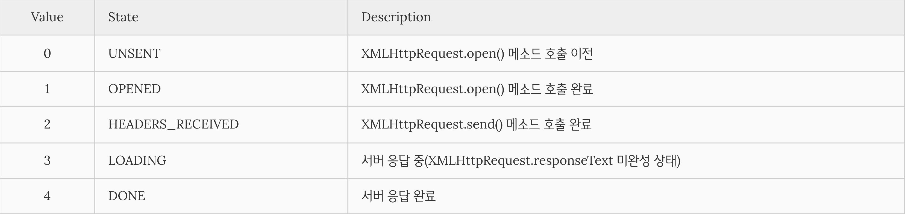

## AJAX (Asynchronous Javascript And XML)

### AJAX 의 정의
> 자바스크립트를 이용해 서버와 브라우저가 ```비동기 방식```으로 데이터를 교환할 수 있는 통신 기능    
브라우저가 가지고있는 ```XMLHttpRequest``` 객체를 이용해서 전체 페이지를 새로 고치지 않고도 페이지의 일부만을 위한 데이터를 로드하는 기법     
==> **자바스크립트를 통해서 서버에 데이터를 비동기 방식으로 요청하는 것**

### 비동기 방식
> 웹페이지를 리로드하지 않고 데이터를 불러오는 방식    
필요한 부분만 불러와 사용할 수 있는 매우 큰 장점을 가지고 있음


### AJAX 를 사용하는 이유
기본적으로 HTTP 프로토콜은 클라이언트쪽에서 Request를 보내고 서버쪽에서 Response를 받으면 이어졌던 연결이 끊기게 되어있다.    
그래서 화면의 내용을 갱신하기 위해서는 다시 request를 하고 response를 하며 페이지 전체를 갱신하게 된다.   
하지만 이렇게 할 경우, 엄청난 자원낭비와 시간낭비를 초래하게 됨    
==> ```AJAX```는 HTML 페이지 전체가 아닌 일부분만 갱신할 수 있도록 XMLHttpRequest객체를 통해 서버에 request 하여 JSON이나 XML형태로 필요한 데이터만 받아 갱신하기 때문에 ```AJAX``` 사용하는 것임!

### AJAX의 진행과정
1. XMLHttpRequest Object를 만든다.
- request를 보낼 준비를 브라우저에게 시키는 과정, 이것을 위해서 필요한 method를 갖춘 object가 필요함
2. callback 함수를 만든다.
- 서버에서 response가 왔을 때 실행시키는 함수, HTML 페이지를 업데이트 함
3. Open a request
- 서버에서 response가 왔을 때 실행시키는 함수, HTML 페이지를 업데이트 함
4. send the request

### AJAX의 사용
XMLHttpRequest 객체를 얻은 뒤, url을 통해 요청하고 응답을 받으면 응답 결과에 맞는 함수를 실행하는 구조로 되어 있다.     
Ajax가 효율적이라고는 해도 이렇게 하게 될 경우, 코드가 길어지기 때문에 jQuery에서 그 문제를 해결해주고 있다.
**JQuery**: HTML의 클라이언트 사이드 조작을 단순화 하도록 설계된 크로스 플랫폼의 자바스크립트 라이브러리   

#### AJAX 요청 처리의 예시 코드
##### JS 를 이용한 코드 예시
1. XMLHttpRequest 객체의 생성
``` js
// XMLHttpRequest 객체의 생성
const xhr = new XMLHttpRequest();
// 비동기 방식으로 Request를 오픈한다
xhr.open('GET', '/users');
// Request를 전송한다
xhr.send();
```
2. XMLHttpRequest.open 메소드를 사용   
XMLHttpRequest 객체의 인스턴스를 생성하고 XMLHttpRequest.open 메소드를 사용하여 서버로의 요청을 준비
``` js
XMLHttpRequest.open(method, url[, async])
```
* method :	[HTTP method](../BackEnd/web.md) (“GET”, “POST”, “PUT”, “DELETE” 등)
* url :	요청을 보낼 URL
* async	: 비동기 조작 여부. 옵션으로 default는 true이며 비동기 방식으로 동작

3. XMLHttpRequest.send   
XMLHttpRequest.send 메소드로 준비된 요청을 서버에 전달한다.
기본적으로 서버로 전송하는 데이터는 GET, POST 메소드에 따라 그 전송 방식에 차이가 있다.
```GET``` 메소드의 경우, URL의 일부분인 쿼리문자열(query string)로 데이터를 서버로 전송 
```POST``` 메소드의 경우, 데이터(페이로드)를 Request Body에 담아 전송
``` js
xhr.send(null);
// xhr.send('string');
// xhr.send(new Blob()); // 파일 업로드와 같이 바이너리 컨텐트를 보내는 방법
// xhr.send({ form: 'data' });
// xhr.send(document);
```
AJAX 예제
``` js
// This function gets invoked when server sends the response
function reqListener (e) {
    console.log(e.currentTarget.response);
}

var oReq = new XMLHttpRequest();
var serverAddress = "https://dami.ajax.com/v0/difficult.json";

oReq.addEventListener("load", reqListener);
oReq.open("GET", serverAddress);
oReq.send();
```
이 코드는 **자바스크립트**를 이용하여 특정 서버에 요청을 보내고 그에 대한 자료를 받아온다.   
일반적으로는 jQuery나 기타 AJAX 기능이 내장되어 있는 라이브러리를 이용하여 AJAX 요청을 처리하는 코드를 작성한다..!   

##### **JQuery** 를 이용한 코드 예시
``` js
var serverAddress = 'https://dami.ajax.com/v0/difficult.json';
// jQuery의 .get 메소드 사용
$.ajax({
    url: ,
    type: 'GET',
    success: function onData (data) {
        console.log(data);
    },
    error: function onError (error) {
        console.error(error);
    }
});
```
``` js
var xhr= new XMLHttpRequest();

xhr. onreadystatechange = function(){
	if(xhr.readyState===4){
    	document.getElementById(‘ajax’).innerHTML= xhr.responseText;
    }
}

xhr.open(‘GET’,”sidebar.html”);  // html메소드와 URL을 보낸다. (open함수는 준비를 시키는것이지 보내는 것은 아니다.)
xhr.send(); 
```
- **var xhr= new XMLHttpRequest()**; : browser response를 얻었을 때 작동하는 함수 (callback 함수)
- **xhr.onreadystatecjange** : AJAX Request에 어떠한 변화라도 있으면 작동 (callback 함수를 포함하고 있다고 생각하면 됨)
- **xhr.readyState** : response가 돌아왔는지 아닌지를 추적하는 property
